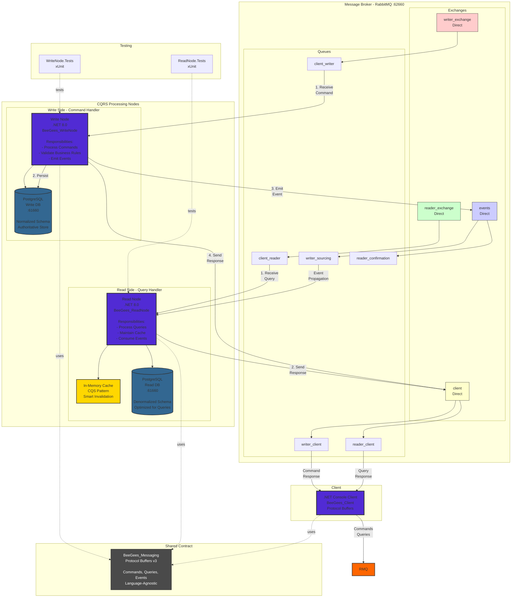
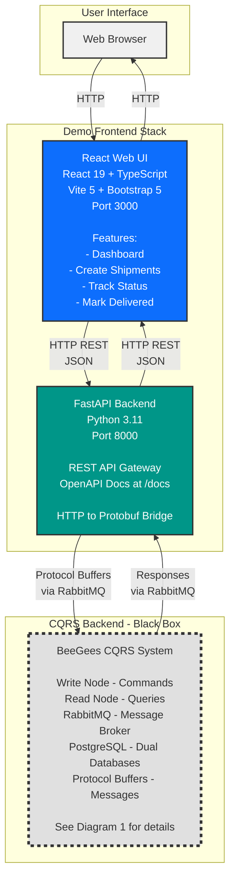

# BeeGees CQRS Shipment Tracking - Architecture Documentation

## Important Note

This repository demonstrates a **CQRS (Command Query Responsibility Segregation)** pattern implementation. The core focus is on the **Read/Write nodes** and their interaction through RabbitMQ.

- **Core Architecture**: Write Node, Read Node, RabbitMQ, PostgreSQL, .NET Client
- **Demo Components**: FastAPI Backend and React UI are provided solely for demonstration purposes to showcase how web applications can interact with the CQRS backend

---

## Architecture Diagram 1: Core CQRS Architecture

This diagram focuses on the **core CQRS implementation** - the Read/Write nodes, message broker, and Protocol Buffer-based communication.



---

## Architecture Diagram 2: Demo Frontend Architecture

This diagram shows how the **demo web application** (FastAPI + React) interacts with the CQRS backend as a **black box**.



### Demo Architecture Notes

- **Purpose**: Demonstrates how web applications can consume the CQRS backend
- **Not Production-Ready**: No authentication, authorization, or production-grade security
- **Focus**: User experience and API integration patterns
- **Technology Choice**: FastAPI and React were chosen for rapid prototyping and broad accessibility

---

## Component Details

### Core Components

#### 1. .NET Console Client (`src/BeeGees_Client/`)
- **Technology**: .NET 8.0, C#
- **Purpose**: Reference implementation and testing tool
- **Communication**: Direct Protocol Buffer messages to RabbitMQ
- **Role**: Demonstrates native Protocol Buffer integration with the CQRS backend

#### 2. Message Broker (RabbitMQ)

#### Exchanges
| Exchange | Type | Purpose |
|----------|------|---------|
| `writer_exchange` | Direct | Routes commands to write node |
| `reader_exchange` | Direct | Routes queries to read node |
| `events` | Direct | Routes events between nodes |
| `client` | Direct | Routes responses back to clients |

#### Queues & Routing
| Queue | Bound To | Routing Key | Purpose |
|-------|----------|-------------|---------|
| `client_writer` | writer_exchange | client_writer | Commands from clients |
| `client_reader` | reader_exchange | client_reader | Queries from clients |
| `writer_sourcing` | events | writer_sourcing | Events to read node |
| `reader_confirmation` | events | reader_confirmation | Confirmations to write node |
| `writer_client` | client | writer_client | Command responses |
| `reader_client` | client | reader_client | Query responses |

#### 3. Write Node (`src/BeeGees_WriteNode/`)

**Technology**: .NET 8.0, C#, Entity Framework Core

**Responsibilities**:
- Process commands (Create, Update, MarkAsDelivered)
- Maintain authoritative data store
- Generate domain events
- Validate business rules
- Send responses to clients

**Database**: PostgreSQL (normalized schema)

**Patterns**:
- Facade pattern for business logic encapsulation
- Command pattern for operations
- Event sourcing for state changes

#### 4. Read Node (`src/BeeGees_ReadNode/`)

**Technology**: .NET 8.0, C#, Entity Framework Core

**Responsibilities**:
- Process queries (GetAllShipments, GetShipmentStatus)
- Maintain denormalized read model
- Implement intelligent caching
- Consume events from write node
- Provide fast query responses

**Database**: PostgreSQL (denormalized for read optimization)

**Caching Strategy**:
- Hierarchical Cached Query String (CQS) pattern
- Format: `{SENDER}/{QUERY_TYPE}/{PARAM}={VALUE}/...`
- Wildcard support for sender (`*`)
- Smart invalidation based on events
- Reflection-based parameter matching

**Example Cache Keys**:
```
backend-api/GetAllShipmentsQuery/CustomerId=12345
*/GetShipmentStatusQuery/ShipmentId=abc-123
*/GetAllShipmentsQuery/CustomerId=12345/Status=InTransit
```

#### 5. Shared Libraries - BeeGees_Messaging (`src/BeeGees_Messaging/`)
**Technology**: Protocol Buffers (protobuf v3)

**Message Types**:
- **Commands**: CreateShipmentCommand, UpdateShipmentCommand, MarkAsDeliveredCommand
- **Queries**: GetAllShipmentsQuery, GetShipmentStatusQuery
- **Events**: ShipmentCreatedEvent, ShipmentUpdatedEvent, ShipmentDeliveredEvent
- **Responses**: Command/Query specific responses
- **Base**: BaseMessage envelope (Type + Blob)

**Purpose**: Language-agnostic message contracts enabling polyglot architecture

#### 6. Testing

- **BeeGees_WriteNode.Tests**: Unit tests for write operations
- **BeeGees_ReadNode.Tests**: Unit tests for read operations and cache behavior
- **Framework**: xUnit
- **CI/CD**: GitHub Actions workflow

---

### Demo Components (Not Core Architecture)

#### React Web UI (`ui/`)
- **Technology**: React 19, TypeScript, Vite 5, Bootstrap 5
- **Port**: 3000 (dev), served via Nginx in production
- **Purpose**: Demo web interface for shipment management
- **Features**:
  - Dashboard with shipment list
  - Create new shipments
  - Update shipment location/status
  - Mark shipments as delivered
  - Responsive design
- **Note**: Provided for demonstration purposes only. Not production-ready.

#### FastAPI Backend (`client/`)
- **Technology**: Python 3.11, FastAPI
- **Port**: 8000
- **Purpose**: HTTP REST API bridge to CQRS backend (demo only)
- **Endpoints**:
  - `POST /api/shipments` - Create shipment
  - `GET /api/shipments?customer_id={id}` - List shipments
  - `GET /api/shipments/{id}` - Get shipment status
  - `PUT /api/shipments/{id}/location` - Update location
  - `POST /api/shipments/{id}/deliver` - Mark delivered
- **Features**:
  - OpenAPI/Swagger documentation (`/docs`)
  - Async request/response correlation
  - Protocol Buffer serialization
- **Note**: Provided for demonstration purposes only. Not production-ready.

## Message Flow Patterns

### Core CQRS Flow: Command Processing (Write)
```
1. .NET Client → RabbitMQ writer_exchange (Protocol Buffers)
2. RabbitMQ client_writer queue → Write Node
3. Write Node → Validate command
4. Write Node → PostgreSQL Write DB (persist)
5. Write Node → RabbitMQ events exchange (emit event)
6. Write Node → RabbitMQ client exchange (send response)
7. RabbitMQ writer_client queue → .NET Client (receive response)
```

### Core CQRS Flow: Event Propagation (Eventual Consistency)
```
1. Write Node → events exchange (ShipmentCreatedEvent)
2. events exchange → writer_sourcing queue
3. writer_sourcing queue → Read Node
4. Read Node → PostgreSQL Read DB (update)
5. Read Node → In-Memory Cache (invalidate affected entries)
```

### Core CQRS Flow: Query Processing (Read)
```
1. .NET Client → RabbitMQ reader_exchange (Protocol Buffers)
2. RabbitMQ client_reader queue → Read Node
3. Read Node → Check In-Memory Cache
   - Cache HIT: Return cached data immediately
   - Cache MISS: Query PostgreSQL Read DB → Store in cache → Return data
4. Read Node → RabbitMQ client exchange (send response)
5. RabbitMQ reader_client queue → .NET Client (receive response)
```

### Demo Flow: Web Application (Optional)

When using the demo FastAPI + React UI:
```
1. Browser → React UI (HTTP)
2. React UI → FastAPI Backend (HTTP REST/JSON)
3. FastAPI → Translate to Protocol Buffers → RabbitMQ
4. RabbitMQ → Write/Read Node (same as core flows above)
5. Write/Read Node → RabbitMQ response → FastAPI
6. FastAPI → Translate to JSON → React UI
7. React UI → Browser (HTTP)
```

## Data Flow Example: Create Shipment (Core CQRS)

```
┌─────────────┐     ┌──────────┐     ┌────────────┐     ┌───────────┐
│ .NET Client │────▶│ RabbitMQ │────▶│ Write Node │────▶│ Write DB  │
└─────────────┘     └──────────┘     └────────────┘     └───────────┘
                          │                  │
                          │                  ▼
                          │           ┌──────────────┐
                          │           │    Event     │
                          │           │  Published   │
                          │           │ (ShipmentCreated)
                          │           └──────────────┘
                          │                  │
                          ▼                  ▼
                    ┌──────────┐     ┌────────────┐
                    │ Response │     │ Read Node  │
                    │  Queue   │     │  Consumes  │
                    └──────────┘     └────────────┘
                          │                  │
                          │                  ▼
                          │           ┌───────────┐
                          │           │  Read DB  │
                          │           │ + Cache   │
                          │           │Invalidated│
                          │           └───────────┘
                          ▼
                    ┌─────────────┐
                    │ .NET Client │
                    │  Response   │
                    └─────────────┘

Key Points:
1. Command processed and persisted immediately
2. Response sent to client without waiting for read node
3. Event propagates asynchronously to read node
4. Eventual consistency: Read node updates independently
```

## Deployment Architecture

### Docker Compose Setup (`docker/docker-compose.yml`)

The full Docker Compose setup includes both core and demo components:

```
┌─────────────────────────────────────────────────────────────┐
│                      Docker Network                          │
│                                                               │
│  CORE COMPONENTS:                                            │
│  ┌──────────┐  ┌──────────┐  ┌──────────┐  ┌──────────┐    │
│  │PostgreSQL│  │ RabbitMQ │  │Write Node│  │Read Node │    │
│  │:61660    │  │:62660    │  │Container │  │Container │    │
│  └──────────┘  └──────────┘  └──────────┘  └──────────┘    │
│                                                               │
│  DEMO COMPONENTS (Optional):                                 │
│  ┌──────────┐  ┌──────────┐                                 │
│  │FastAPI   │  │React UI  │                                 │
│  │:8000     │  │:3000     │                                 │
│  └──────────┘  └──────────┘                                 │
│                                                               │
└─────────────────────────────────────────────────────────────┘
         │              │
         ▼              ▼
    ┌─────────┐  ┌─────────┐
    │Browser  │  │.NET CLI │
    │ (Demo)  │  │ (Core)  │
    └─────────┘  └─────────┘
```

### Minimal Core Deployment

For production or learning the core CQRS concepts, you can run just the essential components:

```bash
# Start only core infrastructure
docker-compose up -d postgres rabbitmq write-node read-node

# Then use the .NET Client to interact
cd src/BeeGees_Client
dotnet run
```

## Technology Stack Summary

### Core CQRS Components

| Component | Technology | Port | Database |
|-----------|-----------|------|----------|
| Write Node | .NET 8.0 | - | PostgreSQL (write) |
| Read Node | .NET 8.0 | - | PostgreSQL (read) |
| .NET Client | .NET 8.0 | - | - |
| RabbitMQ | RabbitMQ 3 | 62660 | - |
| PostgreSQL | PostgreSQL 14+ | 61660 | - |
| Messaging | Protocol Buffers v3 | - | - |

### Demo Components (Optional)

| Component | Technology | Port | Database |
|-----------|-----------|------|----------|
| FastAPI Backend | Python 3.11 | 8000 | - |
| React UI | React 19 + Vite | 3000/80 | - |

## Key Design Patterns

1. **CQRS**: Complete separation of write and read models
2. **Event Sourcing**: State changes captured as immutable events
3. **Eventual Consistency**: Async synchronization between write and read sides
4. **Facade Pattern**: Business logic encapsulation in nodes
5. **Command Pattern**: Structured command handling
6. **Cache-Aside Pattern**: Read-through caching with intelligent invalidation
7. **Request-Response Correlation**: Correlation IDs for async messaging
8. **Polyglot Architecture**: Protocol Buffers enable multiple languages

## Scalability Considerations

- Write and read nodes can scale independently
- Read node can have multiple instances with shared cache coordination
- Message broker provides natural load balancing
- Separate databases allow independent optimization
- Cache reduces database load on read side
- Event-driven architecture enables horizontal scaling

## Consistency Model

**Write Operations**: Immediate consistency
- Client receives confirmation after write DB persists
- Events published asynchronously

**Read Operations**: Eventual consistency
- Read model updated asynchronously via events
- Typical propagation delay: milliseconds
- Trade-off: Performance and availability over immediate consistency

## Security Considerations (Core CQRS Components)

The core CQRS architecture implements the following security measures:

- **RabbitMQ Authentication**: Message broker requires authentication for all connections
- **Database Security**:
  - Connection pooling with secure credential management
  - Parameterized queries via Entity Framework Core to prevent SQL injection
  - Separate credentials for write and read databases
- **Message Validation**: Protocol Buffer type safety and schema validation
- **Business Logic Validation**: Command validation in the Write Node before persistence
- **Network Isolation**: Services communicate via private Docker network in containerized deployments

**Note**: Demo components (FastAPI and React UI) are provided for demonstration purposes only and do not include production-grade security features such as authentication, authorization, rate limiting, or HTTPS enforcement.

## Monitoring & Observability

### Core Components
- **RabbitMQ Management UI**: Available on port 15672 in development
- **Structured Logging**: Comprehensive logging in Write and Read nodes
- **Database Query Logging**: Entity Framework Core query logging
- **Docker Logs**: Aggregated logs via `docker-compose logs`

### Demo Components (Optional)
- **FastAPI Documentation**: Automatic OpenAPI/Swagger UI at `/docs`
- **API Monitoring**: Request/response logging in FastAPI

---

## Summary: Understanding the Architecture

### What Makes This a CQRS System?

This repository demonstrates **pure CQRS principles**:

1. **Complete Separation**: Write and Read operations use separate nodes, models, and databases
2. **Command-Query Segregation**: Commands modify state, queries only read - never mixed
3. **Event Sourcing**: All state changes generate events for synchronization
4. **Eventual Consistency**: Read model catches up asynchronously via events
5. **Independent Scaling**: Write and read sides can be scaled independently

### Core Architecture Focus

When studying or extending this project, focus on:

- **Write Node**: How commands are validated, processed, and persisted
- **Read Node**: How queries are optimized with caching and denormalization
- **RabbitMQ Topology**: How exchanges and queues route messages
- **Event Propagation**: How events synchronize the read model
- **Protocol Buffers**: Language-agnostic message contracts

### Demo Components Purpose

The FastAPI backend and React UI demonstrate:

- How web applications can consume a CQRS backend
- Protocol Buffer to HTTP/JSON translation patterns
- Async request/response correlation over RabbitMQ
- Basic UI patterns for CQRS operations

**They are intentionally simple** and should be viewed as integration examples, not production templates.

### Learning Path Recommendation

1. **Start with Core**: Run the .NET Client against Write/Read nodes to understand pure CQRS
2. **Study Message Flow**: Watch RabbitMQ exchanges and queues as commands/queries execute
3. **Explore Caching**: Observe read node cache behavior and invalidation patterns
4. **Try Demo UI**: See how web applications can integrate with the backend
5. **Extend**: Add new commands, queries, or implement nodes in different languages

### Production Considerations

For production use of the **core CQRS architecture**:

- Implement proper authentication/authorization for RabbitMQ
- Add distributed caching coordination (Redis, etc.) for multi-instance read nodes
- Configure database replication and backups
- Implement circuit breakers and retry policies
- Add comprehensive monitoring and alerting
- Set up TLS/SSL for all network communication
- Implement event replay mechanisms for disaster recovery

The demo components would require significant hardening for production use.
