# BeeGees CQRS Shipment Tracking - Architecture Diagram

## System Overview

```mermaid
graph TB
    subgraph "Client Layer"
        UI[React Web UI<br/>TypeScript + Vite<br/>Port 3000]
        CLI[.NET Console Client<br/>BeeGees_Client]
    end

    subgraph "API Gateway Layer"
        API[FastAPI Backend<br/>Python 3.11<br/>Port 8000]
    end

    subgraph "Message Broker"
        RMQ[RabbitMQ<br/>Port 62660]

        subgraph "Exchanges"
            WE[writer_exchange]
            RE[reader_exchange]
            EE[events]
            CE[client]
        end

        subgraph "Queues"
            CW[client_writer]
            CR[client_reader]
            WS[writer_sourcing]
            RC[reader_confirmation]
            WC[writer_client]
            RQC[reader_client]
        end
    end

    subgraph "CQRS Processing Nodes"
        subgraph "Write Side"
            WN[Write Node<br/>.NET 8.0<br/>BeeGees_WriteNode]
            WDB[(PostgreSQL<br/>Write DB<br/>Normalized)]
            WN --> WDB
        end

        subgraph "Read Side"
            RN[Read Node<br/>.NET 8.0<br/>BeeGees_ReadNode]
            CACHE[In-Memory Cache<br/>CQS Pattern]
            RDB[(PostgreSQL<br/>Read DB<br/>Denormalized)]
            RN --> CACHE
            RN --> RDB
        end
    end

    subgraph "Shared Libraries"
        MSG[BeeGees_Messaging<br/>Protocol Buffers<br/>.proto files]
    end

    subgraph "Testing"
        WT[WriteNode.Tests<br/>xUnit]
        RT[ReadNode.Tests<br/>xUnit]
    end

    %% Client connections
    UI -->|HTTP REST| API
    CLI -->|Protocol Buffers| RMQ
    API -->|Protocol Buffers| RMQ

    %% Exchange to Queue bindings
    WE --> CW
    RE --> CR
    EE --> WS
    EE --> RC
    CE --> WC
    CE --> RQC

    %% Write flow
    CW -->|Commands| WN
    WN -->|Events| EE
    WN -->|Responses| CE

    %% Read flow
    CR -->|Queries| RN
    RN -->|Responses| CE
    WS -->|Events| RN

    %% Shared dependencies
    WN -.->|uses| MSG
    RN -.->|uses| MSG
    CLI -.->|uses| MSG
    API -.->|uses| MSG

    %% Test dependencies
    WT -.->|tests| WN
    RT -.->|tests| RN

    style UI fill:#61dafb,stroke:#333,stroke-width:2px
    style API fill:#009688,stroke:#333,stroke-width:2px
    style WN fill:#512bd4,stroke:#333,stroke-width:2px
    style RN fill:#512bd4,stroke:#333,stroke-width:2px
    style RMQ fill:#ff6600,stroke:#333,stroke-width:2px
    style WDB fill:#336791,stroke:#333,stroke-width:2px
    style RDB fill:#336791,stroke:#333,stroke-width:2px
    style CACHE fill:#ffd700,stroke:#333,stroke-width:2px
    style MSG fill:#4a4a4a,stroke:#333,stroke-width:2px
```



## Component Details

### 1. Client Layer

#### React Web UI (`ui/`)
- **Technology**: React 19, TypeScript, Vite 5, Bootstrap 5
- **Port**: 3000 (dev), served via Nginx in production
- **Purpose**: Modern web interface for shipment management
- **Features**:
  - Dashboard with shipment list
  - Create new shipments
  - Update shipment location/status
  - Mark shipments as delivered
  - Responsive design

#### .NET Console Client (`src/BeeGees_Client/`)
- **Technology**: .NET 8.0, C#
- **Purpose**: Reference implementation and testing tool
- **Communication**: Direct Protocol Buffer messages to RabbitMQ

### 2. API Gateway Layer

#### FastAPI Backend (`client/`)
- **Technology**: Python 3.11, FastAPI
- **Port**: 8000
- **Purpose**: HTTP REST API bridge to CQRS backend
- **Endpoints**:
  - `POST /api/shipments` - Create shipment
  - `GET /api/shipments?customer_id={id}` - List shipments
  - `GET /api/shipments/{id}` - Get shipment status
  - `PUT /api/shipments/{id}/location` - Update location
  - `POST /api/shipments/{id}/deliver` - Mark delivered
- **Features**:
  - OpenAPI/Swagger documentation (`/docs`)
  - Async request/response correlation
  - Protocol Buffer serialization

### 3. Message Broker (RabbitMQ)

#### Exchanges
| Exchange | Type | Purpose |
|----------|------|---------|
| `writer_exchange` | Direct | Routes commands to write node |
| `reader_exchange` | Direct | Routes queries to read node |
| `events` | Direct | Routes events between nodes |
| `client` | Direct | Routes responses back to clients |

#### Queues & Routing
| Queue | Bound To | Routing Key | Purpose |
|-------|----------|-------------|---------|
| `client_writer` | writer_exchange | client_writer | Commands from clients |
| `client_reader` | reader_exchange | client_reader | Queries from clients |
| `writer_sourcing` | events | writer_sourcing | Events to read node |
| `reader_confirmation` | events | reader_confirmation | Confirmations to write node |
| `writer_client` | client | writer_client | Command responses |
| `reader_client` | client | reader_client | Query responses |

### 4. Write Node (`src/BeeGees_WriteNode/`)

**Technology**: .NET 8.0, C#, Entity Framework Core

**Responsibilities**:
- Process commands (Create, Update, MarkAsDelivered)
- Maintain authoritative data store
- Generate domain events
- Validate business rules
- Send responses to clients

**Database**: PostgreSQL (normalized schema)

**Patterns**:
- Facade pattern for business logic encapsulation
- Command pattern for operations
- Event sourcing for state changes

### 5. Read Node (`src/BeeGees_ReadNode/`)

**Technology**: .NET 8.0, C#, Entity Framework Core

**Responsibilities**:
- Process queries (GetAllShipments, GetShipmentStatus)
- Maintain denormalized read model
- Implement intelligent caching
- Consume events from write node
- Provide fast query responses

**Database**: PostgreSQL (denormalized for read optimization)

**Caching Strategy**:
- Hierarchical Cached Query String (CQS) pattern
- Format: `{SENDER}/{QUERY_TYPE}/{PARAM}={VALUE}/...`
- Wildcard support for sender (`*`)
- Smart invalidation based on events
- Reflection-based parameter matching

**Example Cache Keys**:
```
backend-api/GetAllShipmentsQuery/CustomerId=12345
*/GetShipmentStatusQuery/ShipmentId=abc-123
*/GetAllShipmentsQuery/CustomerId=12345/Status=InTransit
```

### 6. Shared Libraries

#### BeeGees_Messaging (`src/BeeGees_Messaging/`)
**Technology**: Protocol Buffers (protobuf v3)

**Message Types**:
- **Commands**: CreateShipmentCommand, UpdateShipmentCommand, MarkAsDeliveredCommand
- **Queries**: GetAllShipmentsQuery, GetShipmentStatusQuery
- **Events**: ShipmentCreatedEvent, ShipmentUpdatedEvent, ShipmentDeliveredEvent
- **Responses**: Command/Query specific responses
- **Base**: BaseMessage envelope (Type + Blob)

**Purpose**: Language-agnostic message contracts enabling polyglot architecture

### 7. Testing

- **BeeGees_WriteNode.Tests**: Unit tests for write operations
- **BeeGees_ReadNode.Tests**: Unit tests for read operations and cache behavior
- **Framework**: xUnit
- **CI/CD**: GitHub Actions workflow

## Message Flow Patterns

### Command Flow (Write)
```
1. Client/UI → API Backend (HTTP)
2. API → RabbitMQ writer_exchange (Protocol Buffers)
3. RabbitMQ client_writer queue → Write Node
4. Write Node → PostgreSQL Write DB (persist)
5. Write Node → RabbitMQ events exchange (emit event)
6. Write Node → RabbitMQ client exchange (send response)
7. RabbitMQ writer_client queue → API Backend
8. API Backend → Client/UI (HTTP response)
```

### Event Propagation (Eventual Consistency)
```
1. Write Node → events exchange (ShipmentCreatedEvent)
2. events exchange → writer_sourcing queue
3. writer_sourcing queue → Read Node
4. Read Node → PostgreSQL Read DB (update)
5. Read Node → In-Memory Cache (invalidate affected entries)
```

### Query Flow (Read)
```
1. Client/UI → API Backend (HTTP)
2. API → RabbitMQ reader_exchange (Protocol Buffers)
3. RabbitMQ client_reader queue → Read Node
4. Read Node → Check Cache
   - Cache HIT: Return cached data
   - Cache MISS: Query PostgreSQL Read DB → Cache result
5. Read Node → RabbitMQ client exchange (send response)
6. RabbitMQ reader_client queue → API Backend
7. API Backend → Client/UI (HTTP response)
```

## Data Flow Example: Create Shipment

```
┌─────────┐     ┌─────────┐     ┌──────────┐     ┌────────────┐     ┌───────────┐
│   UI    │────▶│   API   │────▶│ RabbitMQ │────▶│ Write Node │────▶│ Write DB  │
└─────────┘     └─────────┘     └──────────┘     └────────────┘     └───────────┘
                                      │                  │
                                      │                  ▼
                                      │           ┌────────────┐
                                      │           │   Event    │
                                      │           │ Published  │
                                      │           └────────────┘
                                      │                  │
                                      ▼                  ▼
                                ┌──────────┐     ┌────────────┐
                                │ Response │     │ Read Node  │
                                │  Queue   │     │  Consumes  │
                                └──────────┘     └────────────┘
                                      │                  │
                                      ▼                  ▼
                                ┌─────────┐     ┌───────────┐
                                │   API   │     │  Read DB  │
                                └─────────┘     │ + Cache   │
                                      │         └───────────┘
                                      ▼
                                ┌─────────┐
                                │   UI    │
                                │ Updated │
                                └─────────┘
```

## Deployment Architecture

### Docker Compose Setup (`docker/docker-compose.yml`)

```
┌─────────────────────────────────────────────────────────────┐
│                      Docker Network                          │
│                                                               │
│  ┌──────────┐  ┌──────────┐  ┌──────────┐  ┌──────────┐    │
│  │PostgreSQL│  │ RabbitMQ │  │Write Node│  │Read Node │    │
│  │:61660    │  │:62660    │  │Container │  │Container │    │
│  └──────────┘  └──────────┘  └──────────┘  └──────────┘    │
│                                                               │
│  ┌──────────┐  ┌──────────┐                                 │
│  │FastAPI   │  │React UI  │                                 │
│  │:8000     │  │:3000     │                                 │
│  └──────────┘  └──────────┘                                 │
│                                                               │
└─────────────────────────────────────────────────────────────┘
         │              │
         ▼              ▼
    ┌─────────┐  ┌─────────┐
    │Browser  │  │.NET CLI │
    └─────────┘  └─────────┘
```

## Technology Stack Summary

| Component | Technology | Port | Database |
|-----------|-----------|------|----------|
| Write Node | .NET 8.0 | - | PostgreSQL (write) |
| Read Node | .NET 8.0 | - | PostgreSQL (read) |
| FastAPI Backend | Python 3.11 | 8000 | - |
| React UI | React 19 + Vite | 3000 | - |
| .NET Client | .NET 8.0 | - | - |
| RabbitMQ | RabbitMQ 3 | 62660 | - |
| PostgreSQL | PostgreSQL 14+ | 61660 | - |
| Messaging | Protocol Buffers | - | - |

## Key Design Patterns

1. **CQRS**: Complete separation of write and read models
2. **Event Sourcing**: State changes captured as immutable events
3. **Eventual Consistency**: Async synchronization between write and read sides
4. **Facade Pattern**: Business logic encapsulation in nodes
5. **Command Pattern**: Structured command handling
6. **Cache-Aside Pattern**: Read-through caching with intelligent invalidation
7. **Request-Response Correlation**: Correlation IDs for async messaging
8. **Polyglot Architecture**: Protocol Buffers enable multiple languages

## Scalability Considerations

- Write and read nodes can scale independently
- Read node can have multiple instances with shared cache coordination
- Message broker provides natural load balancing
- Separate databases allow independent optimization
- Cache reduces database load on read side
- Event-driven architecture enables horizontal scaling

## Consistency Model

**Write Operations**: Immediate consistency
- Client receives confirmation after write DB persists
- Events published asynchronously

**Read Operations**: Eventual consistency
- Read model updated asynchronously via events
- Typical propagation delay: milliseconds
- Trade-off: Performance and availability over immediate consistency

## Security Considerations

- RabbitMQ message authentication
- Database connection pooling and parameterized queries
- CORS configuration in FastAPI
- Input validation at API gateway
- Protocol Buffer type safety

## Monitoring & Observability

- RabbitMQ Management UI (port 15672 in dev)
- Structured logging in all nodes
- FastAPI automatic OpenAPI documentation
- Database query logging via EF Core
- Docker logs aggregation
